# FinTech Loan Risk & Customer Analytics

## End-to-End Data Analytics & Business Intelligence Project

---

# Project Overview

An end-to-end fintech analytics project focused on loan risk analysis, customer segmentation, repayment monitoring, and portfolio performance using SQL, Python, MySQL, and Power BI.

---

# Architecture

Raw Data → MySQL → SQL Analytics → Python EDA → Feature Engineering → Power BI Dashboards → Business Insights

---

# Tech Stack

* Python
* Pandas
* NumPy
* Matplotlib
* SQL
* MySQL
* Power BI
* Jupyter Notebook
* Git & GitHub

---

# Database Schema

Main Tables:

* Customers
* Loans
* Transactions
* Repayments
* Credit Scores

---

# SQL Analytics

Performed:

* JOINS
* GROUP BY
* CASE Statements
* Window Functions
* Ranking Analysis
* Repayment Analysis
* Customer Segmentation

---

# Python EDA

Performed:

* Data Cleaning
* Risk Analysis
* Loan Portfolio Analysis
* Repayment Trend Analysis
* Customer Behavior Analysis
* Income Segmentation

---

# Feature Engineering

Created:

* High Risk Flag
* Income Segmentation
* Repayment Ratio
* Loan-to-Income Ratio
* Missed Payment Percentage

---

# Power BI Dashboards

Created interactive dashboards for:

* Executive Overview
* Customer Segmentation
* Loan Risk Analysis
* Repayment & Collection Analytics

---

# Key Insights

* Active loans dominate the portfolio
* Missed payments remain moderately high
* Employment type impacts repayment risk
* Middle-income salaried customers form the largest segment
* Repayment behavior varies across income groups

---

# Screenshots

Project screenshots include:

* SQL query outputs
* Database setup
* Python EDA visualizations
* Power BI dashboards

---

# Future Improvements

* Machine learning risk prediction
* Real-time dashboard integration
* Fraud detection system
* Advanced risk scoring engine
* Customer lifetime value analysis

# Powerbi Dashboard

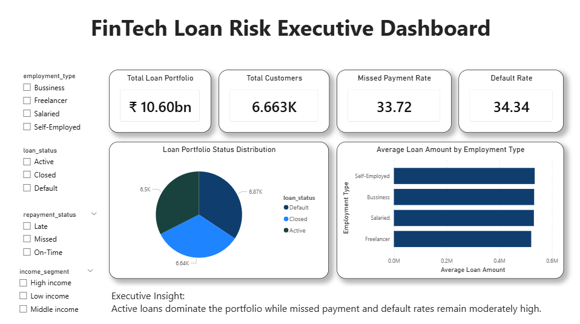

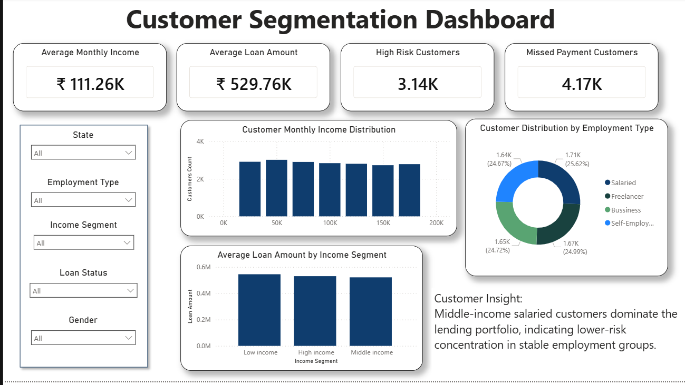

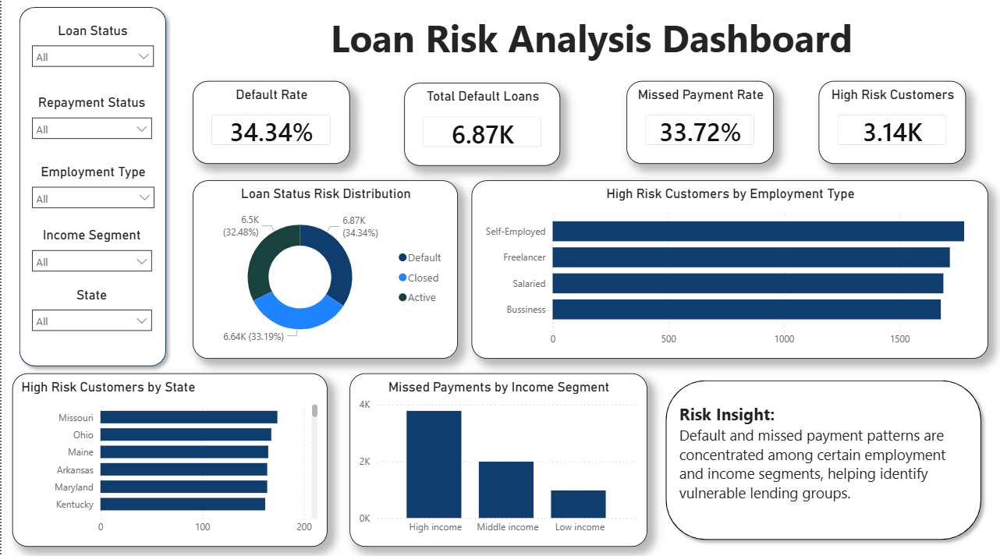

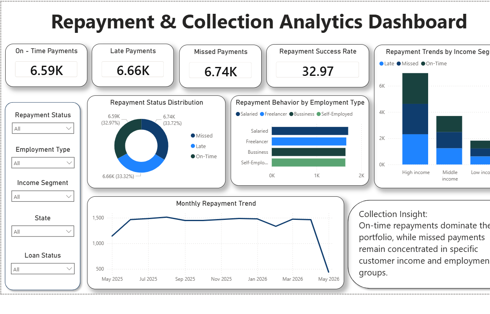

# Python EDA

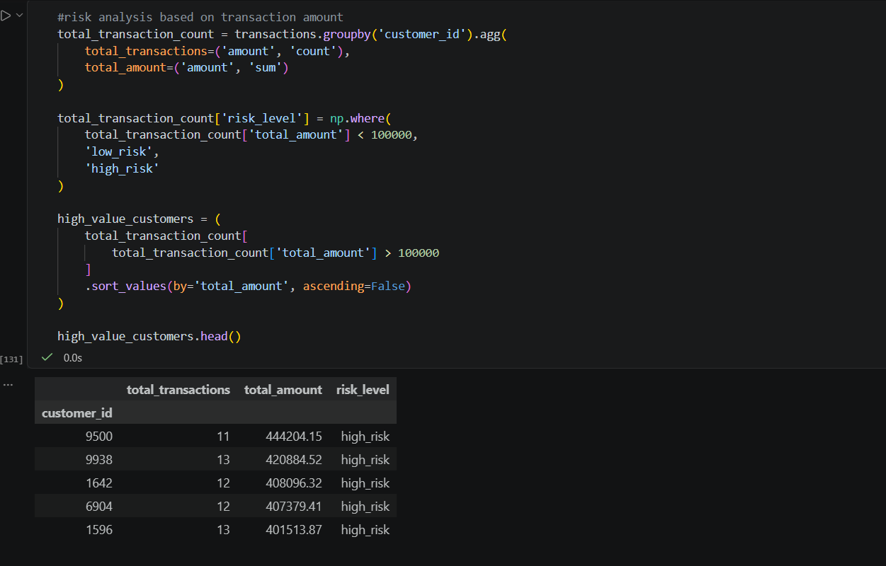

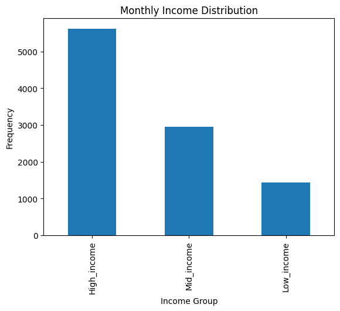

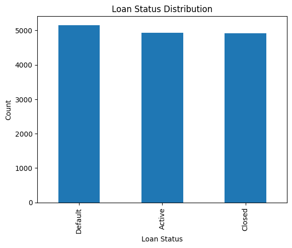

# SQL Queries

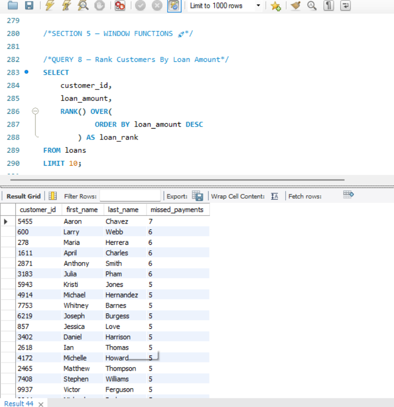

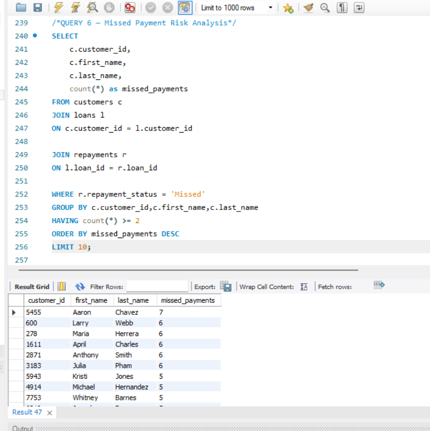

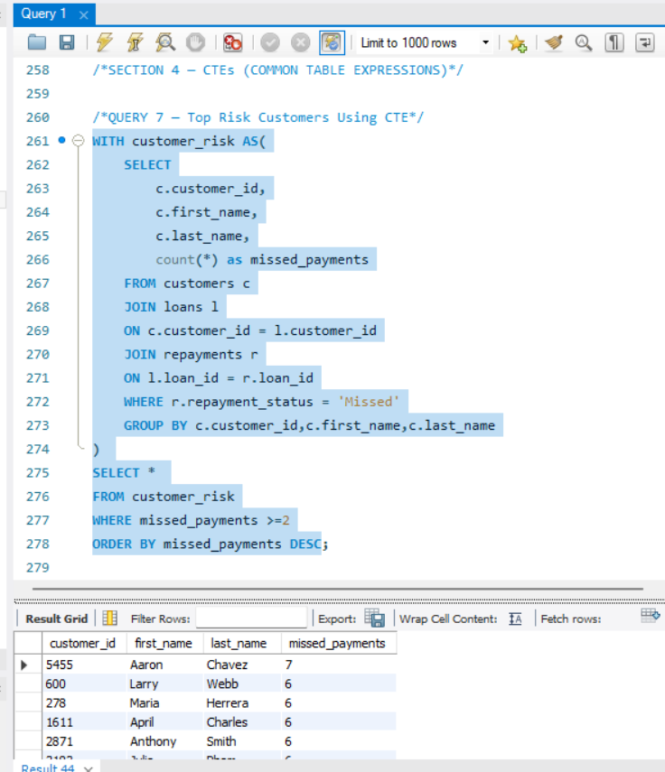

# Database Setup

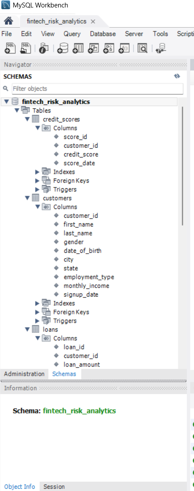
